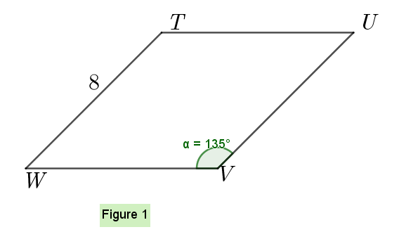
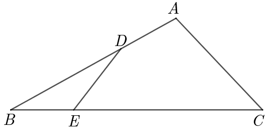
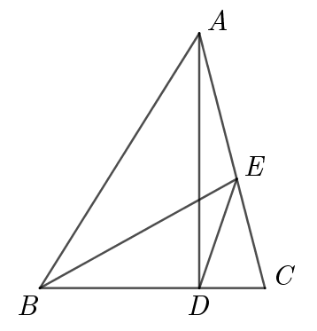

# 三角比练习题-1

1. The area of the rhombus TUVM in Figure 1 is  
    $(A)\; 64 \qquad (B)\; 32 \qquad (C)\; 5.7 \qquad (D)\; 45.3 \qquad (E) 64\sqrt2$

    

2. Which of the following is equal to $(\sec\theta)(\cot\theta)$?    
    $(A)\; \sin\theta \qquad (B)\;\cos\theta \qquad (C)\;\sec\theta \qquad (D)\;\csc\theta \qquad (E)\;\cot\theta$

    补充： 正割函数 $sec(x)=\dfrac{1}{\cos(x)},$ 余割函数 $csc(x)=\dfrac{1}{\sin(x)}$

3. The statement, "If a triangle is equilateral(等边的), then it is not scalene(斜三角形，不等边三角形)," is logically equilvalent(等价) to which of the following?    
    I. If a triangle is not scalene,then it is equileteral.    
    II. If a triangle is not equilateral, then it is scalene.    
    III. If a triangle is scalene, then it is not equilateral.   
    (A) I only    (B) II only    (C) III only   (D) I and II only   (E) I and II only

    补充1：充分条件，必要条件，充要条件。  
    补充2：逆命题，否命题和逆否命题。

4. $(2\sin x)(9\sin x)-(6\cos x)(-3\cos x)=$   
    $(A)\;18 \qquad (B)\;18\sin^2x-18\cos^2x \qquad (C)\;18\sin x+18\cos x \qquad (D)\;36 \qquad (E)\;1$

5. If the sides of a right triangle have lengths $x-3, x+1$, and $x+5$, then $x=$     
    $(A)\;-1 \qquad (B)\;15 \qquad (C)\;4 \qquad (D)\;5 \qquad (E)\;12$

6. 判断三角形的形状  
   （1）三角形$ABC$中，已知三边 $a=9,b=10,c=12$, 则三角形$ABC$的形状是______   
   （2）三角形$ABC$中，若$a\cos B=b\cos A$, 则三角形$ABC$的形状是______   
   （3）三角形$ABC$中，若$a\cos A+b\cos B=c\cos C$, 则三角形ABC的形状是______
  
   解析：
   （1）已知三边，用余弦定理，求最大边所对角的余弦值，$\cos C=\dfrac{a^2+b^2-c^2}{2ab}=\dfrac{81+100-144}{180}=\dfrac{37}{180}$, 在(0,1)区间，故最大角为锐角，故是锐角三角形；  
   （2）用余弦定理将角度化为边长，$a\cdot\dfrac{c^2+a^2-b^2}{2ca}=b\cdot\dfrac{b^2+c^2-a^2}{2bc}, a^2=b^2, a=b$; 也可以通过正弦定理来求解。  
   （3）同（2），$a\cdot\dfrac{b^2+c^2-a^2}{2bc}+b\cdot\dfrac{a^2+c^2-b^2}{2ac}=c\cdot\dfrac{a^2+b^2-c^2}{2ab},$ 两边同时乘以 $2abc，(a^2-b^2)^2=(c^2)^2, |a^2-b^2|=c^2$, 为直角三角形。

7. 三角形$ABC$中, 若 $\angle C=60\degree$, 则 $\dfrac{a}{b+c}+\dfrac{b}{a+c}=$______ 

   解析：余弦定理得到 $\cos C=\dfrac{a^2+b^2-c^2}{2ab}, a^2+b^2=c^2+ab$, 原式 $=\dfrac{a^2+ac+b^2+bc}{(b+c)(a+c)}=\dfrac{c^2+ab+bc+ac}{c^2+ab+bc+ac}=1$

8. 三角形$ABC$中, 若 $\sin A:\sin B=\sqrt{2}:1, 且c^2=b^2+\sqrt2 bc$, 则 $\angle ABC=$______

   解析：正弦定理得到 $a:b=\sin A:\sin B, \therefore a=\sqrt2 b$,   
   余弦定理得到 $\cos A=\dfrac{b^2+c^2-a^2}{2bc}=\dfrac{b^2+c^2-2b^2}{2bc}=\dfrac{c^2-b^2}{2bc}$   
   由于 $c^2-b^2=\sqrt{2}bc$, 所以 $\cos A=\dfrac{\sqrt{2}bc}{2bc}=\dfrac{\sqrt{2}}{2}$, 又 $0\degree<\angle A<180\degree$, 故 $\angle A=45\degree$.  
   从而 $\sin A=\dfrac{\sqrt{2}}{2}, \sin B=\dfrac{\sin A}{\sqrt{2}}=\dfrac{1}{2}$.   
   且 $0\degree<\angle A+\angle B<180\degree, 0\degree<\angle B<135\degree$, 从而 $\angle ABC=30\degree$.   
   <!-- 又 $\angle A+\angle B+ \angle C=180\degree, \therefore \angle C=105\degree$ -->

9. 求三角形的面积  
   
   (1) 三角形$ABC$中, $若a比b长2，b比c长2$，且最大角的正弦值是 $\dfrac{\sqrt3}{2}$, 则 $S_{\triangle{ABC}}=$__________  
   
   (2) 三角形$ABC$中, $\angle A、\angle B、\angle C$的对边分别为 $a、b、c$, 且面积 $S_{\triangle{ABC}}=\dfrac{1}{4}(b^2+c^2-a^2)$, 则 $\angle A=$_________

   解析：   
    (1) $\because a=b+2>b=c+2>c, \angle A+\angle B+\angle C=180\degree, \therefore A>60\degree \ge B>C,$  又 $\sin A=\dfrac{\sqrt{3}}{2}, \therefore \angle A=120\degree, \cos A=-\dfrac{1}{2}=\dfrac{b^2+c^2-a^2}{2bc}=\dfrac{(c+2)^2+c^2-(c+4)^2}{2(c+2)c}=\dfrac{c^2-4c-12}{2c(c+2)}$,  解得 $c^2-c-6=0, (c-3)(c+2)=0, \because c>0, \therefore c=3, b=5, S_{\triangle ABC}=\dfrac{1}{2}bc \sin A=\dfrac{1}{2}\times 5\times 3 \times \dfrac{\sqrt{3}}{2}=\dfrac{15}{4}\sqrt{3}$   

    (2) 由余弦定理：$b^2+c^2-a^2=2bc\cos A, \therefore S_{\triangle ABC}=\dfrac{1}{4}\times 2bc\cos A=\dfrac{1}{2}bc \cos A, 且 S_{\triangle ABC}=\dfrac{1}{2}bc\sin A, \therefore \sin A=\cos A, \tan A=1, 且 0\degree < A<180\degree, \therefore \angle A=45\degree$

10. 若钝角三角形的三边长分别为 $\sqrt{3}, 2, x$, 试求$x$的取值范围。

    解析：分类讨论，因为没有指定哪条边最大。   
    （1） 如果 $x$ 为最大边, 则 $x>2, \cos X=\dfrac{3+4-x^2}{2\times 2\sqrt{3}}, X$为钝角，故 $-1<\cos X<0, 7<x^2<7+4\sqrt{3}$, 解得 $2<\sqrt{7}<x<2+\sqrt{3}$

    (2) 如果2为最大值，设钝角为 $\beta, \cos \beta=\dfrac{x^2+3-4}{2x\sqrt{3}}, 且 -1<\cos\beta<0, x>0,$ 解得：    
    $(i) 0<x<1, (ii) x>2-\sqrt{3}$, 合并(i) (ii)为 $2-\sqrt{3}<x<1$ 

    综上所述，$x$ 的取值范围为 $\sqrt{7}<x<2+\sqrt{3}$ 或 $2-\sqrt{3}<x<1$

11. 如图，若 $AB=6, BC=8, BD=4, \sin B:\sin C=2:3, S_{\triangle{BDE}}:S_{\triangle{ABC}}=1:6$, 求 $DE$

    
    解析：已知两边和两边之比，面积之比。  
    (1) 正弦定理得到 $b:c = \sin B:\sin C = 2:3, \therefore b=|AC|=|AB|\times \dfrac{2}{3}=4$   
    (2) 面积公式得到 $S_{\triangle BDE}=\dfrac{1}{2}|BD|\cdot |BE|\sin B, \\S_{\triangle BAC}=\dfrac{1}{2}|BA|\cdot |BC|\sin B, \\\therefore \dfrac{|BD|\cdot |BE|}{|BA|\cdot |BC|}=\dfrac{1}{6},$ 从而得到 |BE|=2$    
    (3) 在 $\triangle BAC$中，余弦定理得到  $\cos B=\dfrac{a^2+c^2-b^2}{2ac}=\dfrac{7}{8}$  
    (4) 在 $\triangle BDE$中，余弦定理 $|DE|^2=|BD|^2+|BE|^2-2|BD|\cdot|BE|\cos B=4^2+2^2-2\times 4\times 2\times \dfrac{7}{8}=6, \therefore |DE|=\sqrt{6}$

12. 三角形$ABC$中, 已知 $a=2\sqrt{6}, b=6+2\sqrt{3},c=4\sqrt{3}$, 求 $\angle A, \angle B, \angle C$.

    解析：已知三边，求三角。用余弦定理   

    (1) $\cos A=\dfrac{b^2+c^2-a^2}{2bc}=\dfrac{\sqrt{3}}{2}, \therefore \angle A=30\degree$   
    (2) $\cos C=\dfrac{a^2+b^2-c^2}{2ab}=\dfrac{\sqrt{2}}{2}, \therefore \angle C=45\degree$   
    (3) $\therefore \angle B=180\degree-\angle A-\angle C=105\degree$    
    综上所述，$\angle A,\angle B, \angle C$ 分别为 $30\degree, 105\degree,45\degree$

    Note: 能用余弦定理，就不要用正弦定理。正弦定理产生多个值（因为 $\sin(180\degree-\alpha)=\sin\alpha$），需要讨论。

13. 三角形$ABC$中, 设$AD$是高，$BE$ 是角平分线，若 $BC=6, CA=7, AB=8,$ 则 $DE=$_________

    

    解析：已知三边求三角   
    补充：角平分线定理：$BE$为角平分线，则有 $\dfrac{AB}{BC}=\dfrac{AE}{EC}$    
    $\because CA=7, \dfrac{AE}{EC}=\dfrac{8}{6}=\dfrac{4}{3}, \therefore AE=4, EC=3$   

    $要求DE，必须知道DC，设DC=x，则由勾股定理可知：$
    $(1) 在直角三角形ADC和直角三角形ADB中，有 AD^2=AC^2-DC^2=AB^2-BD^2
    \therefore 7^2-x^2=8^2-(6-x)^2, 解得 x=\dfrac{7}{4}$   

    $(2) 在三角形ABC中，利用余弦定理求得 \cos C=\dfrac{7^2+6^2-8^2}{2\times7\times6}=\dfrac{1}{4}$   
    
    $(3) 在三角形DCE中，利用余弦定理得到 DE^2=EC^2+DC^2-2 EC\cdot DC \cdot \cos C=3^2+\big(\dfrac{7}{4}\big)^2-2\times3\times\dfrac{7}{4}\times\dfrac{1}{4}=\dfrac{151}{16}$

$(A)\; \qquad (B)\; \qquad (C)\; \qquad (D)\; \qquad (E)\;$
