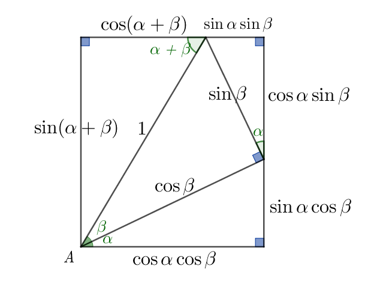
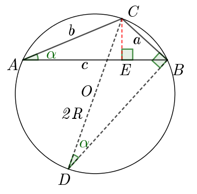
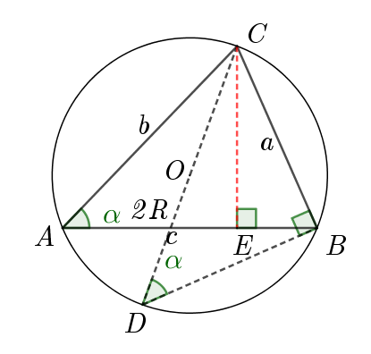
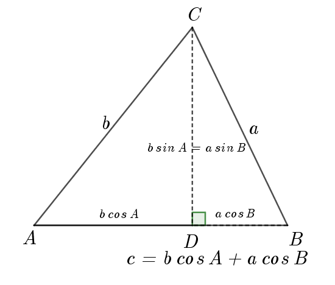

# 八升九数学 第二讲

## Lesson 2 正余弦定理

1. 三角形三边之间的关系
   
    能够构成三角形的三条边，必须满足**三角不等式**。

    **三角不等式**：在三角形中两边之和大于第三边，两边之差小于第三边。用符号表示就是：   
    $|a-b|<c<|a+b| \\ |a-c|<b<|a+c| \\ |b-c|<a<|b+c|$，  
    等价于  
    $d(a,b)\le d(a,c)+d(b,c)\\ d(a,b) \ge |d(a,c)-d(b,c)|$

    类似的有：
    **绝对值不等式、向量不等式和复数不等式**：等价的形式有    
    $||a|-|b|| \le |a\pm b| \le |a|+|b|$  
    此处的 $a,b,c$ 可以是任意实数，向量或复数。

2. 任意角的三角比($0\degree \cdots 180\degree$)

    单位圆解释正弦、余弦、正切和余切函数的曲线   
    分析不同三角比的变化趋势

3. 两角和差公式及其几何证明

    - $\sin(\alpha\pm\beta)=\sin\alpha\cos\beta \pm \cos\alpha\sin\beta$  
    - $\cos(\alpha\pm\beta)=\cos\alpha\cos\beta \mp \sin\alpha\sin\beta$  
    - $\tan(\alpha\pm\beta)=\dfrac{\tan\alpha \pm \tan\beta}{1\mp\tan\alpha\tan\beta}$  
    
    令 $\alpha=\beta$, 则有同角的二倍角关系和万能公式如下：   
    - $\sin 2\alpha=2\sin\alpha\cos\alpha=\dfrac{2\sin\alpha\cos\alpha}{\cos^2\alpha+\sin^2\alpha}\overset{\div \cos^2\alpha}{====}\dfrac{2\tan\alpha}{1+\tan^2\alpha}$  
    - $\cos 2\alpha=\cos^2\alpha-\sin^2\alpha=\dfrac{\cos^2\alpha-\sin^2\alpha}{\cos^2\alpha+\sin^2\alpha}\overset{\div \cos^2\alpha}{====}\dfrac{1-\tan^2\alpha}{1+\tan^2\alpha}$
    - $\cos 2\alpha \overset{\sin^2\alpha=1-\cos^2\alpha}{=======}2\cos^2\alpha-1 \overset{\cos^2\alpha=1-\sin^2\alpha}{=======} 1-2\sin^2\alpha$  
    - $\tan 2\alpha=\dfrac{2\tan\alpha}{1-\tan^2\alpha}$

    令 $t=\tan\alpha \in R, \alpha \in (-\infty,+\infty) 或 \alpha \in R$, 则有万能公式：  
    - $\sin 2\alpha=\dfrac{2t}{1+t^2}\\[1em]$
    - $\cos 2\alpha=\dfrac{1-t^2}{1+t^2}\\[1em]$
    - $\tan 2\alpha =\dfrac{2t}{1-t^2}\\$

    几何证明如下：

    

    **令两角和公式中的 $\beta$ 为 $-\beta$, 就可以得到两角差公式**

4. 正弦定理 The Law of Sines

    $\triangle ABC, R$ 为三角形外接圆的半径，则有：  
    $\dfrac{a}{\sin A}=\dfrac{b}{\sin B}=\dfrac{c}{\sin C}=2R$   

5. 正弦定理的几何证明
   
    
    
    
    **证明一** 在锐角或钝角三角形$ABC$中，  
    $过点C作AB边上的高CE，交AB于点E\\
    连接CE，有\\
    CE=b\sin A=a\sin B\\
    \therefore \dfrac{a}{\sin A}=\dfrac{b}{\sin B}\\
    同理，可以得到\\
    a\sin C=c\sin A \\
    \therefore \dfrac{a}{\sin A}=\dfrac{c}{\sin C}\\$

    **证明二** 面积法  
    同上作辅助线，利用三角形面积公式有：  
    $S_{\triangle ABC}=\frac{1}{2}bc\sin A=\frac{1}{2}ac\sin B=\frac{1}{2}ab\sin C$

    上述等式同时除以 $\frac{1}{2}abc$ ,然后颠倒一下就是正弦定理。

    **证明三** 外接圆方法,在锐角或钝角三角形$ABC$中  
    作$\triangle ABC$的外接圆，过点$C$作直径$CD$，  
    $交外接圆于点D，连接CD和BD。\\
    \because同弧所对的圆周角相等，\\
    \therefore \angle A=\angle D \\
    在 Rt\triangle DBC 中，\sin D=\dfrac{BC}{DC}=\dfrac{a}{2R}\\[1em]
    \therefore \sin A=\dfrac{a}{2R}, \implies \dfrac{a}{\sin A}=2R\\[1em]
    同理可得 \dfrac{b}{\sin B}=\dfrac{c}{\sin C}=2R$

6. 正弦定理变形

    主要利用比例性质来进行变形。

    - $a:b:c=\sin A:\sin B:\sin C$
    - $a=2R\sin A, b=2R\sin B, c=2R \sin C$
    - $a\sin B=b\sin A, b\sin C=c\sin B, a\sin C=c\sin A$
    - $\dfrac{a+b+c}{\sin A+\sin B+\sin C}=\dfrac{a}{\sin A}=\dfrac{b}{\sin B}=\dfrac{c}{\sin C}=2R\\[1em]$
    - $S_{\triangle ABC}=\frac{1}{2}ab\sin C=\frac{1}{2}bc\sin A=\frac{1}{2}ac\sin B$
  
7. 三类正弦定理解三角形的问题

    - 已知三角形的两角与一边，求其他两边和一角
    - 已知三角形的两边和其中一边所对应的角，求其他边角（**要讨论钝角问题**）
    - 运用 $a:b:c=\sin A:\sin B:\sin C$ 解决角之间的转换关系
    - 求三角形面积 $S_{\triangle ABC}=\frac{1}{2}ab\sin C=\frac{1}{2}bc\sin A=\frac{1}{2}ac\sin B$
  
8. 余弦定理 The Law of Cosines
    
    - 余弦定理，是欧几里得平面几何学基本定理。  
    - 余弦定理，是描述三角形中三边长度与一个角的余弦值关系的数学定理，是勾股定理在一般三角形情形下的推广，勾股定理是余弦定理的特例。
    
    $\triangle ABC$中, 则有：  
    $a^2=b^2+c^2-2bc\cos A\\
    b^2=c^2+a^2-2ca\cos B\\
    c^2=a^2+b^2-2ab\cos C$   

    另外一种表现形式如下：   
    $\dfrac{b^2+c^2-a^2}{2bc}=\cos A \\[1ex]
    \dfrac{c^2+a^2-b^2}{2ca}=\cos B\\[1ex]
    \dfrac{a^2+b^2-c^2}{2ab}=\cos C$   

9.  余弦定理几何证明

        
    $c=b\cos A+b\cos B$ 
    平方得到   
    $c^2=a^2 \cos^2B+b^2\cos^2A+2ab\cos A \cos B \\
    \quad = a^2+b^2-(a^2 \sin^2B+b^2\sin^2A)+2ab\cos A\cos B\\
    \quad = a^2+b^2-(a\sin B-b\sin A)^2+2ab(\cos A\cos B-\sin A\sin B)$   
    $\because CD=a\sin B=b\sin A\\
    \therefore c^2 = a^2+b^2+2ab\cos(A+B)\\$
    $\because A+B+C=\pi, \cos(\pi-C)=-\cos C\\
    \therefore c^2 = a^2+b^2-2ab\cos C$    
    同理可得其他两个

10. 余弦定理的作用
    
    余弦定理，是揭示三角形边角关系的重要定理，直接运用它可解决下列问题：
    - 已知三角形的三条边长，可求三角
    - 已知三角形的两边及夹角，可求第三边
    - 已知三角形的两边及其一边的对角，可求其他角和第三边 
    
    利用余弦定理，可以判断三角形形状：  

    - 如果一个三角形两边的平方和**等于=**第三边的平方，那么第三边所对的角一定是直角
    - 如果一个三角形两边的平方和**小于<**第三边的平方，那么第三边所对的角是钝角
    - 如果一个三角形两边的平方和**大于>**第三边的平方，那么第三边所对的角是锐角
  
    还可以求三角形边长取值范围，若对余弦定理加以变形并适当移于其它知识，则使用起来更为方便、灵活。
    
11. 补充海伦公式 Helen

    已知三角形的三边长 $a,b,c$, 记 $p=\dfrac{1}{2}(a+b+c)$, 则有三角形的面积公式为 $S_{\triangle ABC}=\sqrt{p(p-a)(p-b)(p-c)}$

12. 解斜三角形的题型归纳

    关于斜三角形的解法，根据所给的条件及适用的定理可以归纳为如下四种类型：

    (1) **两角及一边**．如已知 $∠A、∠B、a$, 解 $△ABC$, 即求 $b,c,\angle C$．  
    解法：① 根据 $∠A + ∠B + ∠C = 180°$， 求出 $∠C$；  
        ② 根据 正弦定理 $\dfrac{a}{\sin A}=\dfrac{b}{\sin B}=\dfrac{c}{\sin C}$, 求两边 $b、c$；  

    (2) **两边及夹角**． 如已知 $a、b、∠C$，解 $△ABC$，即求 $c, \angle A, \angle B$．  
    解法：① 根据余弦定理 $c^2=a^2+b^2-2ab\cos C$, 求出边 $c$；  
        ② 这样就已知了三边了，根据余弦定理 $\cos A=\dfrac{b^2+c^2-a^2}{2bc}$，求出 $∠A$；  
         **不建议用正弦定理，因为 $\sin A=m$ 会产生两个解。**  
        ③ 由$∠B = 180° − (∠A + ∠C)$， 求出 $∠B$．  
    
    (3) **两边及对角**，如已知$a、b、∠A$， 解$△ABC$, 即求 $c, \angle B, \angle C$．  
    解法：① 根据正弦定理 $\dfrac{a}{\sin A}=\dfrac{b}{\sin B}$，必须经过讨论求出 $∠B$, 因为 $\sin (\pi-\alpha)=\sin \alpha$,所以要考虑钝角的情况；  
        ② 由$∠C + ∠A + ∠B = 180°$，求出$∠C$；   
        ③ 由$\dfrac{a}{\sin A}=\dfrac{c}{\sin C}$，求出边 $c$．  
    
    或  ① 根据 $a^2=b^2+c^2-2bc\cos A$，求出边 $c$；  
        ② 由 $\cos B=\dfrac{a^2+c^c-b^2}{2ac}$，求出 $∠B$；  
        ③ 由$∠A + ∠B + ∠C = 180°$，求出$∠C$．
    
    (4) **三边**，如已知三边 $a、b、c$，解$△ABC$, 即求三角．  
    解法：① 根据余弦定理 $\cos A=\dfrac{b^2+c^2-a^2}{2bc}$,求出$∠A$；  
        ② 根据余弦定理 $\cos B=\dfrac{a^2+c^2-b^2}{2ac}$，求出 $∠B$；  
        ③ 由$∠C = 180° − (∠A + ∠B)$， 求出$∠C$．  

    