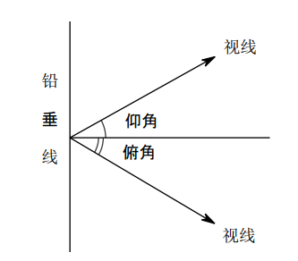
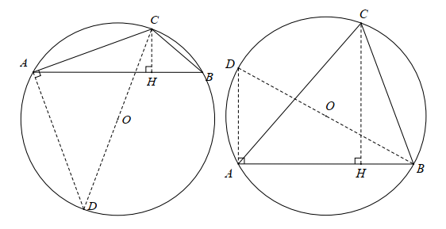

# 王蕊雯-八升九数学

## Lesson 1 锐角三角比定义和应用

1. 定义
    
    $Rt\triangle ABC, AB=c, BC=a, AC=b, \angle C=90\degree=\frac{\pi}{2}$  
    正弦 $\sin A=\frac{a}{c},\qquad$ 
    余弦 $\cos A=\frac{b}{c}$  
    正切 $\tan A=\frac{a}{b},\qquad$ 
    余切 $\cot A=\frac{b}{a}$  
    直角三角形内角关系：$\angle A+\angle B+\angle C=\pi=180\degree, \angle A+\angle B=90\degree=\frac{\pi}{2}$  
    勾股定理: 直角三角形三边之间的关系 $a^2+b^2=c^2$

2. 特殊锐角三角比计算与性质

    针对直角三角形锐角为 $30\degree=\frac{\pi}{6},45\degree=\frac{\pi}{4},60\degree=\frac{\pi}{3}$, 不难算出其正弦、余弦、正切和余切。

3. 同角三角比关系：

    $\sin^2A+\cos^2A=1, \quad\tan A=\frac{\sin A}{\cos A}, \quad \tan A\cdot \cot A=1$

4. 余角三角比关系

    $\sin A=\cos(90\degree-A), \; \cos A=\sin(90\degree-A)$   
    $\tan A=\cot(90\degree-A),\;\cot A=\tan(90\degree-A)$

5. 解直角三角形的应用

    （1）仰角与俯角：同一铅锤面内视线和水平面的夹角，视线在水平线上方的叫做仰角，在水平面下方的叫做俯角  
      
    （2）方向角：从正北或正南方向到目标方向所形成的小于90°的角  
      
    （3）坡度与坡角：坡面的铅锤高度 $h$ 和水平长度 $l$ 的比叫做坡面坡度（或坡比），记作 $i\;(i=\frac{h}{l})$; 坡面与水平面的夹角叫做坡角，记作 $\alpha,(\tan\alpha=i=\frac{h}{l})$. 坡度经常写成 $1:m$ 的形式，如 $i=1:2.4$  
    

6. 经典例题

    （1）几何方法计算 $15\degree, 22.5\degree, 18\degree$ 的三角比
    $\tan 15\degree=2-\sqrt3$   
    $\sin 22.5\degree=\frac{\sqrt{2-\sqrt2}}{2},\qquad \cos 22.5\degree=\frac{\sqrt{2+\sqrt{2}}}{2},\qquad \tan 22.5\degree=\sqrt2-1,\qquad \cot 22.5\degree=\sqrt2+1$  
    $\sin 18\degree=\frac{\sqrt5-1}{4}$

## Lesson 2 正余弦定理

1. 任意角的三角比($0\degree \cdots 180\degree$)

    单位圆解释正弦、余弦、正切和余切函数的曲线   
    分析不同三角比的变化趋势

2. 两角和差公式及其几何证明

    $\sin(\alpha\pm\beta)=\sin\alpha\cos\beta \pm \cos\alpha\sin\beta$  
    $\cos(\alpha\pm\beta)=\cos\alpha\cos\beta \mp \sin\alpha\sin\beta$  
    $\tan(\alpha\pm\beta)=\dfrac{\tan\alpha \pm \tan\beta}{1\mp\tan\alpha\tan\beta}$  
    
    令 $\alpha=\beta$, 则有同角的二倍角关系如下：   
    $\sin 2\alpha=2\sin\alpha\cos\alpha$  
    $\cos 2\alpha=\cos^2\alpha-\sin^2\alpha=2\cos^2\alpha-1 = 1-2\sin^2\alpha$  
    $\tan 2\alpha=\dfrac{2\tan\alpha}{1-\tan^2\alpha}$

    令 $t=\tan\alpha \in R$, 则有万能公式：  
    $\sin 2\alpha=\dfrac{2t}{1+t^2};\qquad \cos 2\alpha=\dfrac{1-t^2}{1+t^2};\qquad \tan 2\alpha =\dfrac{2t}{1-t^2}$

    几何证明如下：

    

    令两角和公式中的 $\beta$ 为 $-\beta$, 就可以得到两角差公式

3. 正弦定理及其几何证明

    $\triangle ABC, R$ 为三角形外接圆的半径，则有：  
    $\dfrac{a}{\sin A}=\dfrac{b}{\sin B}=\dfrac{c}{\sin C}=2R$   

    
    
4. 