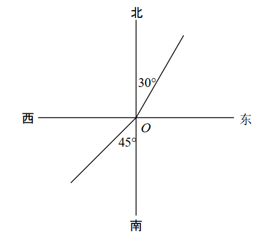
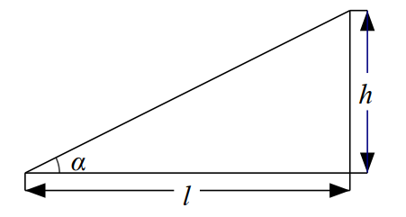
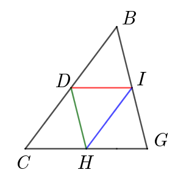
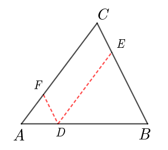
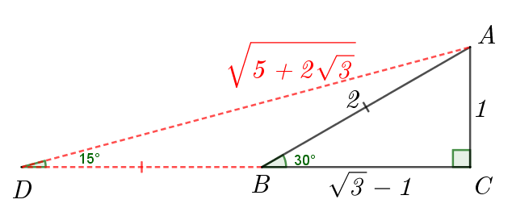
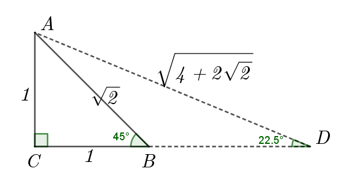
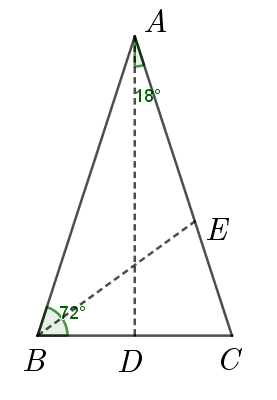
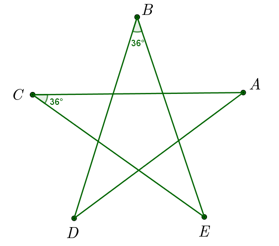

# 八升九数学 第一讲 

## Lesson 1 锐角三角比定义和应用

本讲中的数学术语的中英文对照表
- **直角Right angles** measure 90°   
- **锐角Acute angles** measure less than 90°
- **钝角Obtuse angles** measure greater than 90° but less than 180°.
- **互余Complementary angles** are two angles whose measures add up to 90°
- **互补Supplementary angles** are two angles whose measures add up to 180°
- **对顶角Vertical angles** are opposite angles formed by two intersecting lines.

1. 定义
    
    $Rt\triangle ABC, AB=c, BC=a, AC=b, \angle C=90\degree=\dfrac{\pi}{2}$ 有如下定义：  
    - 正弦 $\sin A=\dfrac{a}{c}\\[1em]$
    - 余弦 $\cos A=\dfrac{b}{c}=\dfrac{adjacent}{hypotenuse}\\[1em]$
    - 正切 $\tan A=\dfrac{a}{b}\\[1em]$
    - 余切 $\cot A=\dfrac{b}{a}\\[1em]$
    - 直角三角形内角关系：$\angle A+\angle B+\angle C=\pi=180\degree, \angle A+\angle B=90\degree=\dfrac{\pi}{2}\\[1em]$
    - 勾股定理: $a^2+b^2=c^2$

2. 特殊锐角三角比计算与性质

    针对直角三角形锐角为 $30\degree=\dfrac{\pi}{6},45\degree=\dfrac{\pi}{4},60\degree=\dfrac{\pi}{3}$, 不难算出其正弦、余弦、正切和余切。

3. 同角三角比关系：

    - $\sin^2A+\cos^2A=1$, 
    - $\tan A=\dfrac{\sin A}{\cos A}$,
    - $\tan A\cdot \cot A=1$

4. 余角三角比关系

    - $\sin A=\cos(90\degree-A), \; \cos A=\sin(90\degree-A)$   
    - $\tan A=\cot(90\degree-A),\;\cot A=\tan(90\degree-A)$

5. 解直角三角形的应用

    （1）仰角与俯角：同一铅锤面内视线和水平面的夹角，视线在水平线上方的叫做仰角，在水平面下方的叫做俯角  
      
    （2）方向角：从正北或正南方向到目标方向所形成的小于90°的角  
      
    （3）坡度与坡角：坡面的铅锤高度 $h$ 和水平长度 $l$ 的比叫做坡面坡度（或坡比），记作 $i\;(i=\frac{h}{l})$; 坡面与水平面的夹角叫做坡角，记作 $\alpha,(\tan\alpha=i=\frac{h}{l})$. 坡度经常写成 $1:m$ 的形式，如 $i=1:2.4$  
    

6. 三角形中位线定理
   
    在任意$ΔBCG$中, $D,H,I$分别是$BC, CG, GB$的中点。则有:   
    $DH=\dfrac{1}{2}BG, DH\parallel BG\\$  
    $HI=\dfrac{1}{2}BC, HI\parallel BC\\$  
    $DI=\dfrac{1}{2}CG, DI\parallel CG$

    

7. 平行线定理
   
    在$ΔABC$中, $D, E, F$分别是$AB, BC, AC$线段上的点。  
    已知: $DE//AC, DF//BC$, 则有   
    $(1) \triangle BDE \sim \triangle BAC \implies \\$
    $DE:AC=BE:BC=BD:BA \\$
    $(2) \triangle ADF \sim \triangle ABC \implies \\$
    $DF:BC=AD:AB=AF:AC$

    

8. 勾股定理 Pythagorean Theorem
   直角三角形中，斜边的平方等于两条直角边的平方和。即 $c^2=a^2+b^2$  
   常用的勾股数 Pythagorean triples 有 (3,4,5),(5,12,13),(7,24,25),(8,15,17)

9.  经典例题

    （1）几何方法计算 $15\degree, 22.5\degree, 18\degree$ 的三角比  
    - $\tan 15\degree=2-\sqrt3$   
    - $\sin 22.5\degree=\frac{\sqrt{2-\sqrt2}}{2},\; \cos 22.5\degree=\frac{\sqrt{2+\sqrt{2}}}{2},\; \tan 22.5\degree=\sqrt2-1,\; \cot 22.5\degree=\sqrt2+1$  
    - $\sin 18\degree=\frac{\sqrt5-1}{4}$

    作辅助线方法如下：
    1. 15°角如下
    
        

    2. 22.5°角如下
    
        
        
    3. 18°角如下
    
        

    4. 黄金分割与五角星

        
