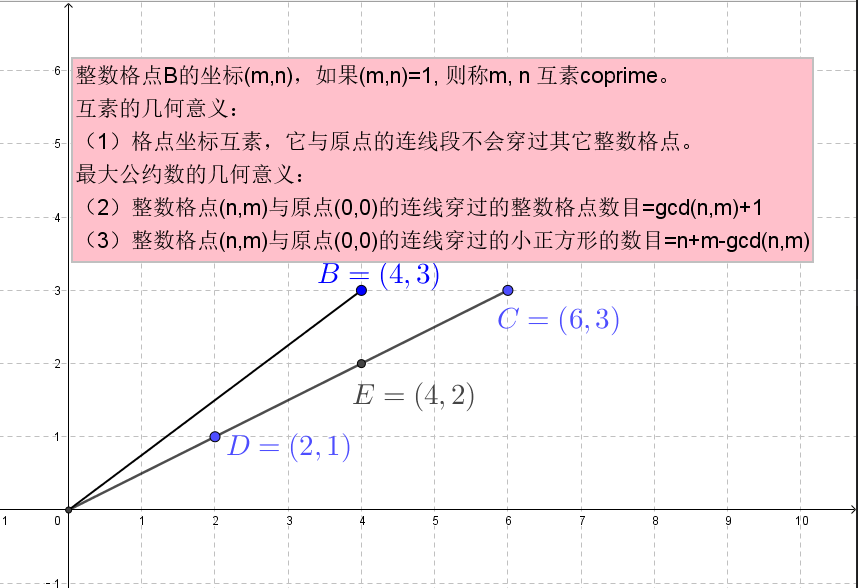

# 约数与倍数进阶篇

约数与倍数相互依存，有如下关系式：

$\boxed{两数的最大公约数与最小公倍数的乘积等于两数的乘积，gcd(a,b)\times lcm(a,b)=a\times b}$

注意: 该性质不能推广到三个及以上的情形。

因为有上述关系式，所以，我们只要有求最大公约数的方法，最小公倍数就可以通过上述关系式得到。这也是很多软件中，只有求最大公约数的函数，而没有提供求最小公倍数的函数的原因。

## 多个数互素(coprime)
------------

如果 $(a,b)=1$, 即最大公约数为1，则称 $a、b$ 互素。譬如 (4,9)=1, (6,7)=1

1. 两个连续整数一定互素，$(n,n+1)=1,\; n \in \mathrm{N}$
2. 奇数和偶数一定互素，$(2n,2m+1)=1,\; n,m \in \mathrm{N}$
3. 求多个数的最大公约数，可以用嵌套完成：$gcd(a,b,c)=gcd(gcd(a,b),c)$，便于程序实现。
4. 如果 $(a,b)=1，a\mid bc$, 则 $a\mid c$
5. 如果 $(a,b)=1$, 则 $(a^n,b^m)=1,\;n,m\in \mathrm{N^+}$
6. 如果 $(a,b)=1，br\equiv bs\;(\mod a)$, 则 $r\equiv s\;(\mod a)$
7. 如果 $(a,b)=(a,c)1$, 则 $(a,bc)=1$

## 互素的几何体现
    
在$\textcolor{red}{\large平面直角坐标系（笛卡尔坐标系）}$中，互素的两个数组成的格点$(n,m)$到原点$(0,0)$的连线，不会通过其他任何格点（即坐标是整数点，端点除外）。或者说连线穿过的格点（整数点）数目为2（仅仅包含两个端点）。

存在关系式：**连线穿过的格点数目$=gcd(n,m)+1$**, 示例参见下图：

[互素的几何现象GGB](ggb/互素和最大公约数的几何现象.ggb)

## 最大公约数的几何体现

连接原点$(0,0)$到格点$(n,m)$的对角线，穿过的整数格点数为$(n,m)+1$，穿过的小正方形数目就是$n+m-(n,m)$. 

## 应用例题
-----------

### 例1 时间周期问题
成阿姨每6天去一次菜市场，李伯伯每8天去一次菜市场，今天早上他俩刚好在菜市场相遇，问下一次在菜市场相遇是几天后?

$\qquad A.\;12 \qquad B.\;18 \qquad C.\;24 \qquad D.\;48$

解析：成阿姨每6天去一次菜市场，则成阿姨下次去菜市场的天数就是6天、12天、18天后、……，都为6的倍数，同理李伯伯去菜市场的天数就是8的倍数。

要使得两人在菜市场再次相遇，则下次去菜市场的天数一定是两人的公倍数，题干问的是下次两人在菜市场相遇的时间，故此题就是两人去菜市场天数的最小公倍数，6与8的最小公倍数为24，选择C项。

### 例2 长度切割问题
有三根铁丝，分别长12米、18米、24米，现在要把它截成同样长的小段且铁丝没有浪费，最少可以截多少段?

$\qquad A.\;5\qquad B.\;7\qquad C.\;9\qquad D.\;12$

解析：要在截的过程中没有浪费，则截后每一段的长度应该是总长度的约数;又将铁丝截成同样长的小段，则所求为三段铁丝长度的公约数。

铁丝的总长=所截铁丝的段数×每段的长度，要使得段数最少，则由于总长固定，只能让每一段尽可能的长，因此所截每一段的长度为三段铁丝长度的最大公约数。12、18、24的最大公约数为6，三根铁丝所截段数分别为2、3、4，故最少可截9段，选择C项。

注意：一维空间分割问题案例

### 例3 平面镶嵌问题
用一批正方形地砖铺满一块长25米，宽15米的空地，正方形地砖最大边长为多少?

解析：根据题意，得知该空地的长 25 米需要用 n 个正方形铺满，同时宽 15 米也需要用同样的正方形 m 个铺满，则说明该正方形的边长是 25 和 15 的公约数，因为 n、m 这样的数值表示正方形个数一定是正整数，并且问题求解正方形最大的边长，因此为求解两数的最大公约数。

因为(25,15)=5，所以此题答案为 5 米。

### 例4 时间周期问题
甲每3天去图书馆一次，乙每8天去图书馆一次，3月1日这天两个人恰好在图书馆相遇，请问下一次两人相遇是在哪天?

解析：类似例1，根据题意，甲每3天去一次，经过了 n 个 3 天，同时乙每 8 天去一次，可能经过了 m 个 8 天，正好两人相遇，因为 n、m 表示个数为正整数，则说明经过的天数一定是 3和8 的公倍数，

又问下一次相遇，则所求为3和8的最小公倍数，即为24天，经过24天的下一次相遇时间为3月25日。

### 例5 已知最大公约数和最小公倍数，求两数
已知 $A、B$ 两数的最大公约数为 5，最小公倍数为 60，则这两个数分别是多少?

解法1：由最大公约数和最小公倍数的关系式，可知 $A\times B=gcd(A,B)\times lcm(A,B)=5\times60=300=3\times2^2\times5^2$. 因为 $gcd(A,B)=5$，所以 $A,B$ 必定都含有 5 的约数，剩下 12 要拆成互素的两个数的乘积，只能是拆成 $3和4$，故 $A、B$ 只能是 $3\times5,4\times5$,即15和20。

解法2：在短除求解最大公约数的过程中，可以看到最小公倍数中含有最大公约数，则 $60\div5=12，12$ 为这两个数除以最大公约数之后得到的两个商的乘积，并且这两个商是互素的，因此 $12=3\times4$，所求的两个数分别为 $5×3=15，5×4=20$。

### 例6 翻牌游戏
设有编号为$1、2、3、\cdots、10$的10张背面向上的纸牌，现有10名游戏者，第1名游戏者将所有编号是1的倍数的纸牌翻成另一面向上的状态，接着第2名游戏者将所有编号是2的倍数的纸牌翻成另一面向上的状态，……，第$n$名$(n≤10)$游戏者，将所有编号都是 $n$ 的倍数的纸牌翻成另一面向上的状态，如此下去，第10名游戏者翻完纸牌后，那些纸牌正面向上的最大编号与最小编号的差是：

$\qquad A.\;2\qquad B.\;4\qquad C.\;6\qquad D.\;8$

解法一：本题初看感觉题目很复杂，但是仔细理解发现这道题目并不复杂，也可以用最简单最原始的方法——**枚举法**解题，1号游戏者会将所有卡片进行翻转，2号则会将编号为2、4、6、8、10进行翻转，3号游戏者则会将编号为3、6、9的卡片进行翻转….依次类推，最终得出结论，正面朝上的卡片编号为 $1, 4, 9$, 故最终答案为选项 $D$。 

|次序|1  |2  |3  |4  |5  |6  |7  |8  |9  |10 |
|--- |---|---|---|---|---|---|---|---|---|---|
|一  |+  |+  |+  |+  |+  |+  |+  |+  |+  |+  |
|二  |+  |-  |+  |-  |+  |-  |+  |-  |+  |-  |
|三  |+  |-  |-  |-  |+  |+  |+  |-  |-  |-  |
|四  |+  |-  |-  |+  |+  |+  |+  |+  |-  |-  |
|五  |+  |-  |-  |+  |-  |+  |+  |+  |-  |+  |
|六  |+  |-  |-  |+  |-  |-  |+  |+  |-  |+  |
|七  |+  |-  |-  |+  |-  |-  |-  |+  |-  |+  |
|八  |+  |-  |-  |+  |-  |-  |-  |-  |-  |+  |
|九  |+  |-  |-  |+  |-  |-  |-  |-  |+  |+  |
|十  |+  |-  |-  |+  |-  |-  |-  |-  |+  |-  |

注意：表格中 + 表示正面， - 表示背面

解法二：本题需要理解题目实质，游戏者需要翻转卡片，而翻转的规则是卡片号为游戏者编号的倍数的需要去翻转，反之，如果游戏者的编号是卡片编号的约数需要翻转，即这张卡片有几个约数就需要翻转几次，但是题目规定卡片最初的状态是背面向上，最终状态为正面向上，即需要翻转奇数次，试想哪些数字的约数个数是奇数个，普通数字的约数个数必然成对出现，而只有**平方数的约数个数为奇数个**。所以这道题的本质即为10以内，最大的平方数和最小的平方数之差为几。显然 $9-1=8$. 答案当选 $D$。

### 例7 时间周期问题
某单位小范每5天去体育馆打一次羽毛球，小许每9天去一次，老刘每12天去一次。某天三人在体育馆相遇，那么下一次相遇至少要多少天?

$\qquad A.\; 120\qquad B.\; 180\qquad C.\; 540\qquad D.\; 80$

解析：类似例1，只是多了一个数而已。本题实质考察倍数中的公倍数，关键仍需理解题目本质。问题最终问下一次相遇需过多少天，试想，这一次相遇到下一次相遇，小范是5天去一次，所以过的天数必然是5的倍数;同理小许每9天去一次，所以过的天数必然是9的倍数;老刘是12天去一次，即过的天数必然为12的倍数，所以过的天数应为 $5,9,12$ 的公倍数，这一次到下一次应为最小公倍数。因为 $lcm(5,9,12)=180$, 答案当选 $B$。

### 例题8 已知GCD和LCM，求这两个数

两个自然数不成倍数关系，它们的最大公约数是18，最小公倍数是216，求这两个数。

解析：设这两个数分别是 $n,m, \; n\le m$

$\because (n,m)=18,\;\therefore n=18a,\;m=18b,\;(a,b)=1\\ [n,m]=18\times a\times b=216\\ a\times b=12, \therefore a=3,\;b=4$

所以这两个数分别是 $18\times3=54,\;18\times4=72$

答：这两个数分别为54和72。

### 例题9 已知GCD和LCM，求这两个数

两个自然数的最大公约数是6，最小公倍数是420，如果这两个数相差18，求这两个数。

解析：设这两个数分别是 $n,m, n\ge m$

$\because (n,m)=6,\;\therefore 可设n=6a,\;m=6b,\;(a,b)=1,\; a\ge b\\ \because [n,m]=6\times a\times b=420\\ a\times b=70,\\ \because n-m =18, \therefore a-b=3, 故得到 a=10,\;b=7$

所以这两个数分别是 $6\times10=60,\;6\times7=42$

答：这两个数分别为60和42。

### 例题10 求三个数

甲乙的最小公倍数是90，乙丙的最小公倍数是105，甲丙的最小公倍数是126，求甲为多少？

解析：设甲乙丙这三个数分别是 $n,m,k$

$\because [n,m]=90=2\times3^2\times5,\; [m,k]=105=3\times5\times7,\; [n,k]=126=2\times3^2\times7
\\ \therefore k=3\times7\times c,\; n=2\times3^2\times a,\; m=3\times5\times b,\;(a,b)=1,\;(b,c)=1,\;(a,c)=1
\\得到 a=1, \; n=18, \; m=5 或 15, k=21 或 7 \\ 甲数为18，乙丙有三种种可能(15,7), (5,21), (15,21)$

所以这三个数分别是 $(18,5,21), (18,15,21), (18,15,7)$

答：甲数为18。

### 例题11 利用约数个数反求原数

甲乙是不同的两个自然数，它们都只含有素因数2和3，并且都有12个约数，它们的的最大公约数是12，求甲乙两数之和是多少？

解析：设甲乙这两个数符合 $2^a\cdot 2^b,\; (a+1)(b+1)=12=2^2\times3$,

因为 12 有 $(2+1)\times(1+1)=6$ 个约数，可以拆成两组大于1的数相乘，只能是 $2\times6,3\times4$。

设 甲为 $2^{a_1}3^{b_1}$, 乙为 $2^{a_2}3^{b_2}$,   
依题意可知：$\gcd(2^{a_1}3^{b_1}, 2^{a_2}3^{b_2}）=12=2^2\times3 \iff min(a_1,a_2)=2, min(b_1,b_2)=1$

经过尝试，发现 只有拆成 $3\times4, 6\times2$, 即 $2^2\times3^3, 2^5\times3^1$ 时，满足题意。

故两数之和为 $2^2\cdot3^3+2^5\cdot3=2^2\cdot3(3^2+2^3)=12\times17=204$

答：甲乙两数之和是204。

## 练习题
-----

1. 一个数和16的最大公约数是8，最小公倍数是80，这个数是多少？$\\[7em]$

2. 一个数和24的最大公约数是8，最小公倍数是120，那么这个数是多少？$\\[7em]$
 
3. 两个小于150的数的乘积是2028，它们的最大公约数是13，求这两个数。$\\[7em]$

4. 两个数的最大公约数是18，最小公倍数是180，两个数的差是54，求这两个数。$\\[7em]$

5. 三个正整数$a、b、c$, 已知 $a与b、a与c、b与c$的最小公倍数分别是525、28和300，那么 $a$ 的值是多少？$\\[7em]$

6. $A、B$两数都只含有素因数3和5，它们的最大公约数是75，已知 $A$ 有12个约数，$B$ 有10个约数，那么 $A、B$ 两数之和是多少？$\\[7em]$

7. 已知 $a与b$ 的最大公约数是14，$a与c、b与c$ 的最小公倍数都是350，且 $a不大于b$，那么满足条件的自然数 $a、b、c$ 共有多少组？$\\[7em]$

## 作业
-----

1. 甲是36，甲乙两数的最大公约数是4，最小公倍数是288，那么乙是多少？$\\[7em]$

2. 已知两个自然数的积是240，最小公倍数是60，那么这两个数是多少？$\\[7em]$

3. 已知两数的最大公约数是21，最小公倍数是105，那么这两个数的和是多少？$\\[7em]$

4. 甲乙两数的最小公倍数是60，乙丙两数的最小公倍数是70，甲丙两数的最小公倍数是84，那么甲数是多少？$\\[7em]$

5. $A、B$ 两数的最小公倍数是144，已知数 $A$ 有12个约数，数 $B$ 有10个约数，那么 $A、B$ 两数的和是多少？

