# 小学数学-几何面积模型

FileName:  
    PriAreaModule-面积模型.md

Created Date:  
    August 31, 2020  

Author:  
    Liu Xiang    

Contact:  
    liuxiangxyd@163.com

## 1. 常用几何图形的面积

（1）**矩形 Rectangle** 的面积是 **长$\times$宽**，即 $S_{矩形}=a\times b, \; a,b分别是矩形的长和宽$。

（2）**平行四边形 quadrilateral** 的面积是 **长$\times$高**，即 $S_{平行四边形}=a\times h_a, \; a 是平行四边形的一边，h_a是该边上的高$。

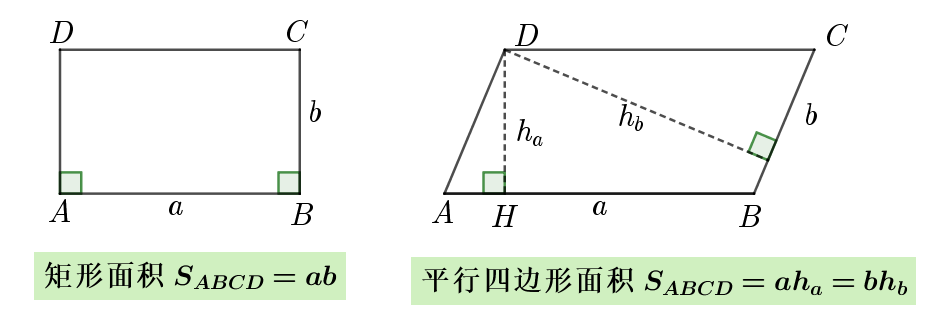

（3）**直角三角形 Right triangle** 的面积：通过构造 **矩形** 得到，等于 **两直角边乘积的一半**，即 $S_{直角三角形}=\dfrac{1}{2}ab, \;a,b分别是直角三角形的两直角边长$。

（4）**三角形 Triangle** 的面积：通过构造 **平行四边形** 得到，**底乘以高除以2**，即 $S_{三角形}=\dfrac{1}{2}ah_a, a为三角形的底边长，h_a为该底边上的高 Height$。

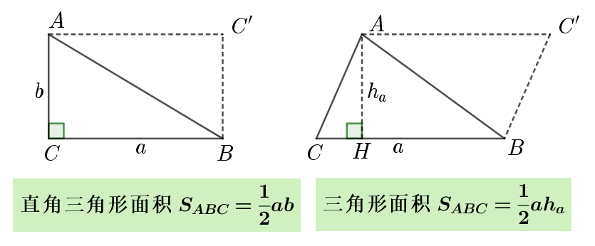

（5）**梯形 Trapezoid** 的面积：通过分割成 **四边形和三角形之和**而得到，**上下底之和乘以高除以2**，即 $S_{梯形}=\dfrac{1}{2}(a+b)h, \;a,b为梯形的上底和下底边长，h为该底边上的高$。

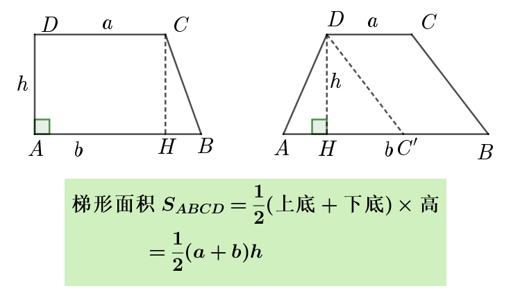

## 2. 等高模型

三角形面积 与 边长和高 有关，故 **面积之比** 就等于 **边长与高的乘积之比**。

当两个三角形等高时，其面积之比就等于 **边长之比**。

求面积问题就转化为求边长之比的问题，反之也是。

**例1.** 如图，三角形ABC中，D为AB的中点，即AD=DB，E、F为AC的三等分点，即AE=EF=FC，已知阴影部分的面积为2平方厘米，则 三角形ABC的面积是 _______ 平方厘米。

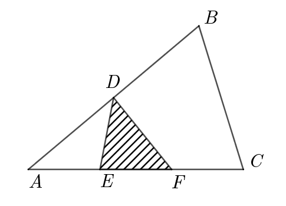

解题过程：

[例题1解析](ggb/例题1.ggb)

练习1. 如图，三角形ABC的面积是**48**，D、E和F分别是BC、AC和AD的中点，则 三角形DEF的面积是 _______。

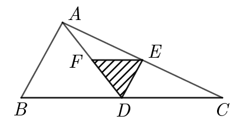

[练习1解析](practice/练习1.ggb)

## 3. 鸟头模型

先看是否共角或等角或互补，判断是否是鸟头模型。

**鸟头模型的等角或互补角的两边乘积之比就是其面积之比。**

step1. 将四边形分割成两个三角形，有两种方法可选，连接一条对角线即可。

step2. 按比例计算目标面积，用已知面积表示未知面积。

step3. 最后得到目标面积与已知面积的比例关系。

**例2.** 如图，三角形ABC中，D、E分别为AB、AC上的点，且AD:AB=2:5，AE:AC=3:5，已知三角形ADE的面积为 **12** 平方厘米，则 三角形ABC的面积是 _______ 平方厘米。

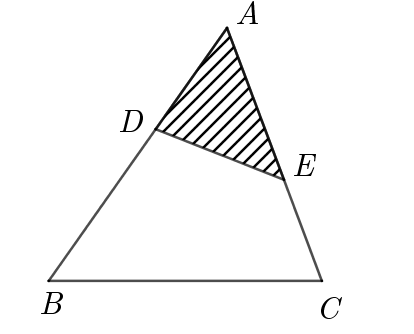

解题过程：

[例题2解析](ggb/例题2.ggb)

练习2. 如图，三角形ABC中，AB是AD的5倍，AC是AE的3倍，三角形ADE的面积为**1**，则 三角形ABC的面积是 _______。

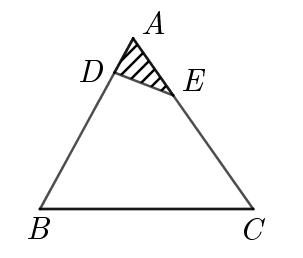

[练习2解析](practice/练习2.ggb)

## 4. 一半模型

![一半模型]

**长方形和平行四边形一半模型**：寻找长方形中 **同高**的三角形或者构造 **同高**三角形。

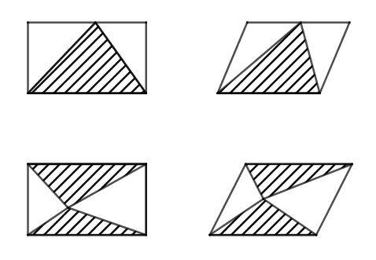

**梯形一半模型**: 图中为腰上的中点和中线

**中点一半模型**：图中为中点

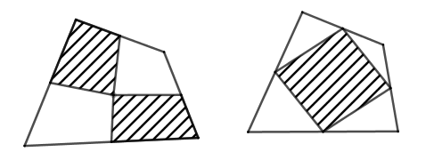

**例3.** 如图，长方形AFEB和长方形FDCE拼成了长方形ABCD，长方形ABCD的长为 **15**， 宽为 **6**，则 它内部阴影部分的面积是 _______ 。

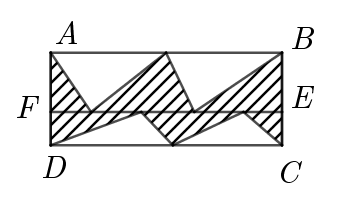

解题过程：

[例题3解析](ggb/例题3.ggb)

练习3. 如图，一个长方形ABCD分成4个不同的三角形，绿色三角形BEC面积占长方形面积的15%，黄色三角形ADE面积为**21** 平方厘米，则 长方形的面积是 _______平方厘米。

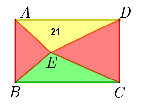

[练习3解析](practice/练习3.ggb)

**例4.** 如图，正方形ABCD的面积是40平方厘米，点E、F、G分别是正方形ABCD边上的中点，H为AD边上的任意一点，则阴影部分的面积是 _______ 平方厘米。

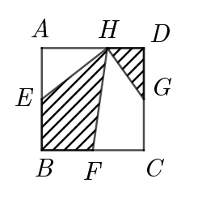

解题过程：

[例题4解析](ggb/例题4.ggb)

练习4. 如图，长方形ABCD的面积为40，E、F、G为各边中点，H为AD边上任意一点，问阴影部分面积是 _______。

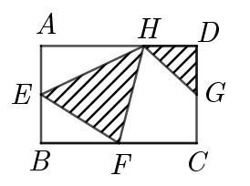

[练习4解析](practice/练习4.ggb)

## 5. 燕尾模型

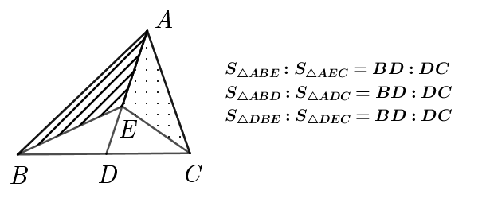

**例5.** 如图，三角形ABC被分成了5个小三角形，其中4个的面积已经标注在图上了，则阴影部分的面积是 _______。

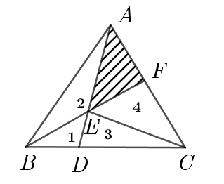

解题过程：

[例题5解析](ggb/例题5.ggb)

练习5. 如图，三角形ABC被分成了5个小三角形，其中3个的面积已经标注在图中，则阴影部分的面积是 _______。

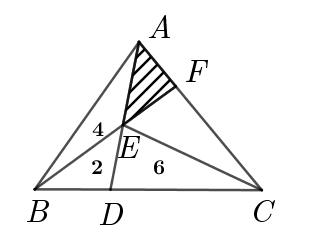

[练习5解析](practice/练习5.ggb)

**例6.** 如图，三角形ABC的面积为1，E是AC的中点，点D在BC上，且BD:DC=1:2，AD与BE交于点F，则四边形DFEC的面积是 _______。

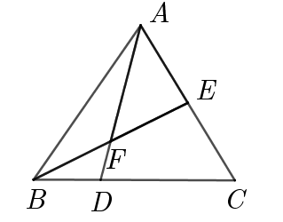

解题过程：

[例题6解析](ggb/例题6.ggb)

练习6. 如图，长方形ABCD的面积为24平方厘米，EC=2DE，F是DG的中点，则阴影部分的面积是 _______ 平方厘米。

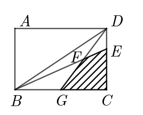

[练习6解析](practice/练习6.ggb)

## 6. 风筝模型

## 7. 蝴蝶模型

## 8. 复合图形拆分
